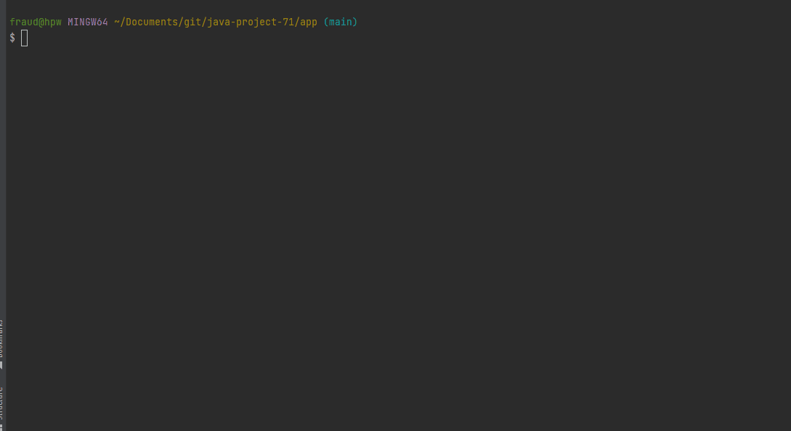
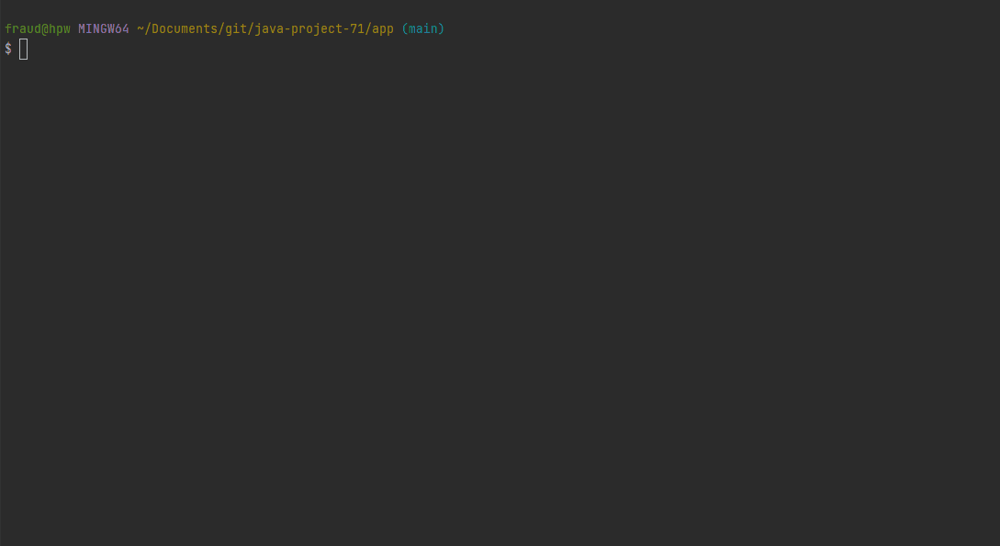
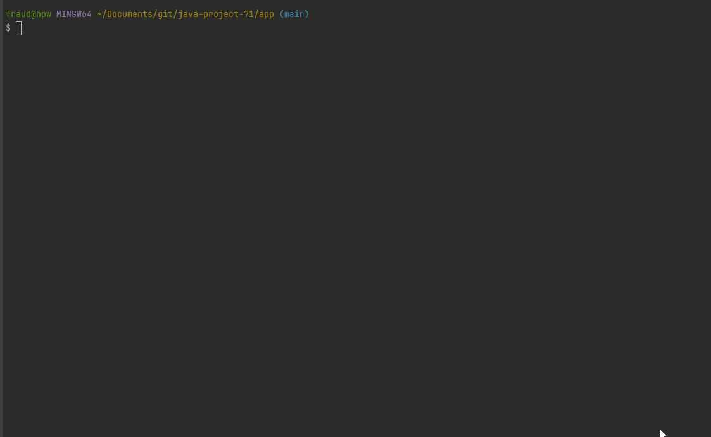
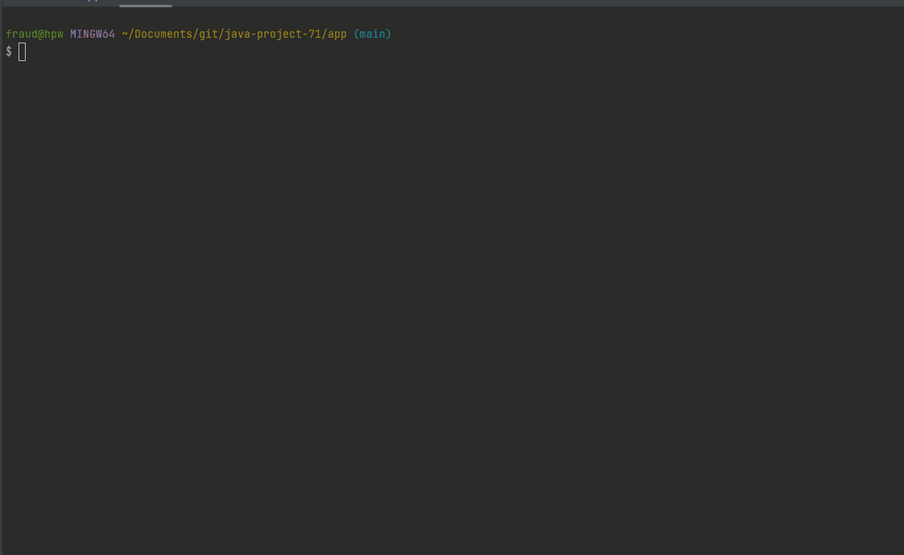

# Java App for finding difference in two flat JSON or two flat YML

Training project on [HEXLET](https://ru.hexlet.io/programs/java/projects/71).

This is an application based on Java for finding difference in two json or two yml files.
User should start an App with two options: paths to 2 json files or to 2 yml files.
User could add flag `--f` or `-format` additionally. Supports 3 output formats: stylish, json or plain. Stylish is default.
Here is a few examples how to start the app:

`app path\to\firstfile.json path\to\secondfile.json --format plain` -> you'll get the result as plain
`app path\to\firstfile.json path\to\secondfile.json --format json` -> you'll get the result as json
`app path\to\firstfile.json path\to\secondfile.json` -> you'll get stylish result
`app path\to\firstfile.yml path\to\secondfile.yml --format plain` -> you'll get the result as plain
`app path\to\firstfile.yml path\to\secondfile.yml --format json` -> you'll get the result as json
`app path\to\firstfile.yml path\to\secondfile.yml` -> you'll get stylish result

You can see how it works below.

### Flat JSON comparing with stylish output

### Flat YML comparing with stylish output

### Select how output would look like using flags -f stylish or -f json with json input

### Select how output would look like using flags -p with yml input 

### how to run project locally
Requirements:
- knowledge of how to start java-app
- Java
- [make tool](https://www.gnu.org/software/make/)
- probably Intellij IDEA
1. Clone project:
   `git clone https://github.com/zheleznikov/java-project-71.git`
2. Install project: `make install`
3. e.g. `./build/install/app/bin/app path/to/file1 path/to/file2 --fromat stylish`

### My impressions
- that's my first experience with picocli
- that's my first experience with creating pipelines on github

###### for my techincal using
- Success start hexlet running `git update-index --chmod=+x gradlew`